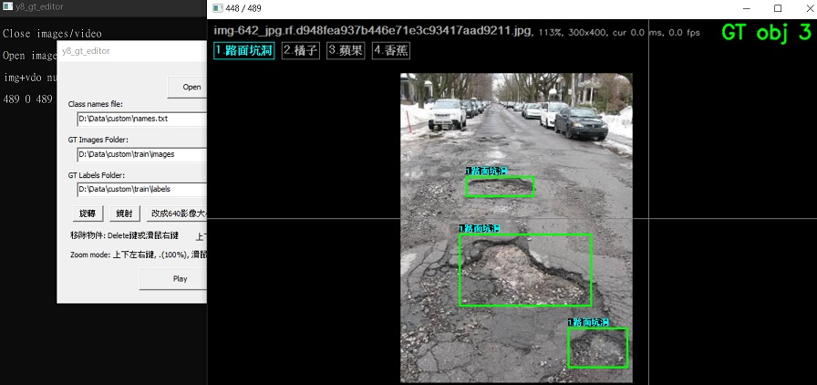

# y8_train_test
提供 YOLOv8 物件偵測標註/訓練/測試等工具集 <br />

包含幾個工具:
1. y8_gt_editor (Windows 環境底下標註工具)
2. 「YOLOv8_Tutorial」的副本 (Google Colab 環境)
3. y8_detect (Windows 環境底下偵測工具)
4. y8_detect_gt (Windows 環境底下同時顯示偵測結果與標註工具)

## 1. 標註工具 - y8_gt_editor

此為 Windows 64-bit 環境底下一個 GUI 工具程式 <br />
操作方式 - 透過拖曳方式將以下三個項目從檔案總管拖曳到 Dialog 上: <br />
* Class names file: 類別名稱定義檔(文字檔)，每一行表示一個類別名稱，支援中文(UTF8格式)，參考範例: [dataset/Pothole.v1/name.txt](./dataset/Pothole.v1/name.txt) <br />
* GT Images Folder: YOLOv8 影像資料夾，參考範例: [dataset/Pothole.v1/train/images](./dataset/Pothole.v1/train/images) <br />
* GT Labels Folder: YOLOv8 Ground Truth 標記檔案資料夾，參考範例: [dataset/Pothole.v1/train/labels](./dataset/Pothole.v1/train/labels) <br />

然後點選 Open, 瀏覽上下頁透過 PgUp, PgDn 按鍵，新增物件透過拖曳滑鼠方式，滑鼠右鍵(或Delete按鍵)移除物件，標記不同類別ID可以在物件上直接點選數字(1..9, 如果只有一個類別表示全為 1):


## 2.「YOLOv8_Tutorial」的副本 (Google Colab 環境)
使用 Colab 開啟 「YOLOv8_Tutorial」的副本.ipynb 並建立個人副本 <br />
包含以下幾個操作步驟: <br />
```
步驟1: 掛載 Google 雲端硬碟
步驟2: 將影像資料從 Google 雲端硬碟複製到 Colab
步驟3:　Setup 建置訓練環境
步驟4：開始訓練模型
步驟5: 將訓練好的模型(best.pt)模型複製到 Google 雲端硬碟
步驟6: 將訓練好的模型(best.pt)轉成其他格式(best.onnx)
```
