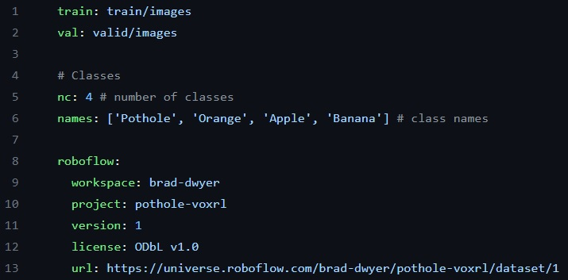

# y8_train_test
## 提供YOLOv8物件偵測標註/訓練/測試等工具集

包含四個工具:
1. 標註工具 - [y8_gt_editor](./binary) (Windows環境底下標註工具)
2. 訓練工具 - [「YOLOv8_Tutorial」的副本](./「YOLOv8_Tutorial」的副本.ipynb) (Google Colab環境)
3. 偵測工具 - [y8_detect](./binary) (Windows環境底下偵測工具)
4. 同時檢視偵測結果與編輯GT - [y8_detect_gt](./binary) (Windows環境底下同時顯示偵測結果與標註工具)

與一個範例資料集(一個類別物件):
* [dataset/custom](./dataset/custom)
  - [custom.yaml](./dataset/custom/custom.yaml)檔案
  - [train](./dataset/custom/train): 包含465張影像
    - [images](./dataset/custom/train/images)資料夾(465個.jpg檔)
    - [labels](./dataset/custom/train/labels)資料夾(465個.txt檔)
  - [valid](./dataset/custom/valid): 包含133張影像
    - [images](./dataset/custom/valid/images)資料夾(133個.jpg檔)
    - [labels](./dataset/custom/valid/labels)資料夾(133個.txt檔)
  - [test](./dataset/custom/test): 包含67張影像
    - [images](./dataset/custom/test/images)資料夾(67個.jpg檔)
    - [labels](./dataset/custom/test/labels)資料夾(67個.txt檔)



## 1. 標註工具 - [y8_gt_editor](./binary)

此為Windows 64-bit環境底下一個GUI工具程式, <br />
操作方式 - 透過拖曳方式將以下三個項目從檔案總管拖曳到Dialog上: <br />
* Class names file: 類別名稱定義檔(文字檔)，每一行表示一個類別名稱，支援中文(UTF8格式)，參考範例: [dataset/custom/name.txt](./dataset/custom/name.txt) <br />
* GT Images Folder: YOLOv8格式影像資料夾，參考範例: [dataset/custom/train/images](./dataset/custom/train/images) <br />
* GT Labels Folder: YOLOv8格式Ground Truth標記檔案資料夾(一張影像檔對應一個文字檔)，參考範例: [dataset/custom/train/labels](./dataset/custom/train/labels) <br />

然後點選Open, 瀏覽上下頁透過PgUp, PgDn按鍵，新增物件透過拖曳滑鼠方式(綠色框)，滑鼠右鍵(或Delete按鍵)移除物件，標記不同類別ID可以在物件上直接按數字按鍵(1..9, 如果只有一個類別物件表示全為 1):


## 2. 訓練工具 - [「YOLOv8_Tutorial」的副本](./「YOLOv8_Tutorial」的副本.ipynb) (Google Colab 環境)
使用 Colab 開啟 「YOLOv8_Tutorial」的副本.ipynb 並建立個人副本, <br />
包含以下幾個操作步驟: <br />
```
步驟1: 掛載Google雲端硬碟
步驟2: 將影像資料從Google雲端硬碟複製到Colab
步驟3: Setup建置訓練環境
步驟4: 開始訓練模型
步驟5: 將訓練好的模型(best.pt)模型複製到Google雲端硬碟
步驟6: 將訓練好的模型(best.pt)轉成其他格式(best.onnx)
步驟7: 使用程式碼方式(Python/ONNX/OpenCV)進行預測與顯示物件偵測結果
```

### 步驟1: 掛載Google雲端硬碟
```
from google.colab import drive
drive.mount('/content/drive')
```
### 步驟2: 將影像資料從Google雲端硬碟複製到Colab
```
!mkdir datasets
!cp drive/MyDrive/custom/custom.yaml .
!cp -r drive/MyDrive/custom/train datasets/
!cp -r drive/MyDrive/custom/valid datasets/
!cp -r drive/MyDrive/custom/test datasets/
```
### 步驟3: Setup建置訓練環境
```
%pip install ultralytics
import ultralytics
ultralytics.checks()
```
### 步驟4: 開始訓練模型
```
# Train YOLOv8n on custom dataset for 40 epochs
!yolo task=detect mode=train model=yolov8n.pt data=custom.yaml epochs=40 close_mosaic=20 lr0=0.01 weight_decay=0.0005 warmup_epochs=3.0 imgsz=640 batch=16 name=yolov8n_custom exist_ok=True
```
### 步驟5: 將訓練好的模型(best.pt)模型複製到Google雲端硬碟
```
!cp runs/detect/yolov8n_custom/weights/best.pt drive/MyDrive/custom
```
### 步驟6: 將訓練好的模型(best.pt)轉成其他格式(best.onnx)
```
!yolo export model=drive/MyDrive/custom/best.pt format=onnx
```
### 步驟7: 使用程式碼方式(Python/ONNX/OpenCV)進行預測與顯示物件偵測結果
```
...
```
### Predict command line方式
```
!yolo predict model=runs/detect/yolov8n_custom/weights/best.pt source=datasets/test/images/img-344_jpg.rf.dd4eebb8836b8efe2a2cce77d61349b7.jpg show=True save=True conf=0.1
import cv2
from google.colab.patches import cv2_imshow
img = cv2.imread('runs/detect/predict/img-344_jpg.rf.dd4eebb8836b8efe2a2cce77d61349b7.jpg')
cv2_imshow(img)
```

經過以上步驟1-7執行後可以得到以下偵測結果(步驟7產生): <br />


## 3. 偵測工具 - [y8_detect](./binary)

此為Windows 64-bit環境底下一個GUI工具程式, <br />
操作方式 - 透過拖曳方式將以下三個項目從檔案總管拖曳到Dialog上: <br />
* YOLOv8 detection model (onnx format): ONNX格式模型檔，參考範例: [dataset/custom/best.onnx](./dataset/custom/best.onnx) <br />
* Class names file: 類別名稱定義檔(文字檔)，每一行表示一個類別名稱，支援中文(UTF8格式)，參考範例: [dataset/custom/name.txt](./dataset/custom/name.txt) <br />
* 若勾選Live Webcam則表示使用攝影機，此時忽略以下Images欄位
* Images (folder/image/video file): 測試影像(或影片)資料夾，參考範例: [dataset/custom/test/images](./dataset/custom/test/images) <br />

然後點選Open, 瀏覽上下頁透過PgUp, PgDn按鍵，可以設定偵測門檻值(th, 範圍 0..1 間，門檻值愈高誤報愈少，偵測率愈低，反之門檻值愈低誤報愈多，偵測率愈高):


## 4. 同時檢視偵測結果與編輯GT - [y8_detect_gt](./binary)

此為Windows 64-bit環境底下一個GUI工具程式, <br />
操作方式 - 透過拖曳方式將以下五個項目從檔案總管拖曳到Dialog上: <br />
* YOLOv8 detection model (onnx format): ONNX格式模型檔，參考範例: [dataset/custom/best.onnx](./dataset/custom/best.onnx) <br />
* Class names file: 類別名稱定義檔(文字檔)，每一行表示一個類別名稱，支援中文(UTF8格式)，參考範例: [dataset/custom/name.txt](./dataset/custom/name.txt) <br />
* Images (folder/image/video file): 測試影像(或影片)資料夾，參考範例: [dataset/custom/test/images](./dataset/custom/test/images) <br />
* GT Images Folder: YOLOv8格式影像資料夾(可以與以上Images 欄位使用相同資料夾)，參考範例: [dataset/custom/test/images](./dataset/custom/test/images) <br />
* GT Labels Folder: YOLOv8格式Ground Truth標記檔案資料夾(一張影像檔對應一個文字檔)，參考範例: [dataset/custom/test/labels](./dataset/custom/test/labels) <br />

然後點選Open, 瀏覽上下頁透過PgUp, PgDn按鍵，可以設定偵測門檻值(th, 範圍 0..1 間，門檻值愈高誤報愈少，偵測率愈低)調整偵測結果(左邊藍色物件框)，與編輯右邊Ground Truth物件(右邊綠色物件框)，點選左邊藍色物件框會自動生成右邊綠色 GT 框:

